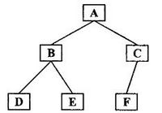

# 树

树是一种层次结构，在数据库领域，搜索领域有着广泛的应用。

## 树的相关定义

树（*tree*）是包含n个结点，n-1条边的有穷集，其中：

（1）每个元素称为结点（*[node](https://baike.baidu.com/item/node/4689680)*）。

（2）有一个特定的结点被称为根结点或树根（*[root](https://baike.baidu.com/item/root/73226)*）。

结点的度：一个结点含有的子结点的个数称为该结点的度；

[叶结点](https://baike.baidu.com/item/叶结点/9795627)：[度](https://baike.baidu.com/item/度/5622311)为0的结点称为[叶结点](https://baike.baidu.com/item/叶结点/9795627)；

孩子结点：一个结点含有的子树的[根结点](https://baike.baidu.com/item/根结点/9795570)称为该结点的[子结点](https://baike.baidu.com/item/子结点/9795653)；

[父结点](https://baike.baidu.com/item/父结点/9796346)：若一个结点含有[子结点](https://baike.baidu.com/item/子结点/9795653)，则这个结点称为其[子结点](https://baike.baidu.com/item/子结点/9795653)的[父结点](https://baike.baidu.com/item/父结点/9796346)；

[兄弟结点](https://baike.baidu.com/item/兄弟结点/9796359)：具有相同[父结点](https://baike.baidu.com/item/父结点/9796346)的结点互称为[兄弟结点](https://baike.baidu.com/item/兄弟结点/9796359)；

树的深度：定义一棵树的根结点层次为1，其他结点的层次是其[父结点](https://baike.baidu.com/item/父结点/9796346)层次加1。一棵树中所有结点的层次的最大值称为这棵树的深度。

树的高度：定义其最底层的叶节点高度为1，其父节点依次加+1，根节点的数值称为树的高度。

森林：由m棵互不相交的树的集合称为森林。

## 树的种类

无序树：树中任意节点的子结点之间没有顺序关系，这种树称为无序树,也称为自由树；

[有序树](https://baike.baidu.com/item/有序树)：树中任意节点的子结点之间有顺序关系，这种树称为有序树；

[二叉树](https://baike.baidu.com/item/二叉树/1602879)：每个节点最多含有两个子树的树称为二叉树；

[满二叉树](https://baike.baidu.com/item/满二叉树)：叶节点除外的所有节点均含有两个子树的树被称为满二叉树；

[完全二叉树](https://baike.baidu.com/item/完全二叉树)：如果对满二叉树的结点进行编号, 约定编号从根结点起, 自上而下, 自左而右。则深度为k的, 有n个结点的二叉树, 当且仅当其每一个结点都与深度为k的满二叉树中编号从1至n的结点一一对应时, 称之为完全二叉树。简而言之，相比于满二叉树，只有底层右侧部分没有叶节点。

[哈夫曼树](https://baike.baidu.com/item/哈夫曼树/2305769)（最优二叉树）：带权路径最短的二叉树称为哈夫曼树或最优二叉树。

## 树的遍历



* 前序遍历

依次访问其父节点，左子树，右子树。图示树的前序遍历为：ABDECF。

* 中序遍历

依次访问其左子树，父节点，右子树。图示树的中序遍历为：DBEAFC。

* 后序遍历

依次访问其左子树，右子树，父节点。图示树的后序遍历为：DEBFCA。

* 层次遍历

依次遍历每一层，即按高度从左往右遍历每个节点。

```java
// 前序遍历
class Solution {
    List<Integer> preOrder = new ArrayList<Integer>();
    public List<Integer> preorderTraversal(TreeNode root) {

        if( root == null)
            return preOrder;
        scan(root);
        return preOrder;
    }
    private void scan(TreeNode root)
    {
        if(root == null)
            return;
        preOrder.add(root.val);
        scan(root.left);
        scan(root.right);
    }
}

// 中序遍历
class Solution {
     List<Integer> midOrder = new ArrayList<Integer>();
    public List<Integer> inorderTraversal(TreeNode root) {
          if( root == null)
                return midOrder;
        scan(root);
        return midOrder;
    }
    private void scan(TreeNode root)
    {
        if(root == null)
            return;
        scan(root.left);
        midOrder.add(root.val);
        scan(root.right);
    }
}

// 后序遍历
class Solution {
    List<Integer> postOrder = new ArrayList<Integer>();
    public List<Integer> postorderTraversal(TreeNode root) {
        if( root == null)
            return postOrder;
        scan(root);
        return postOrder;
    }
    private void scan(TreeNode root)
    {
        if(root == null)
            return;
        scan(root.left);
        scan(root.right);
        postOrder.add(root.val);
    }
}


```


